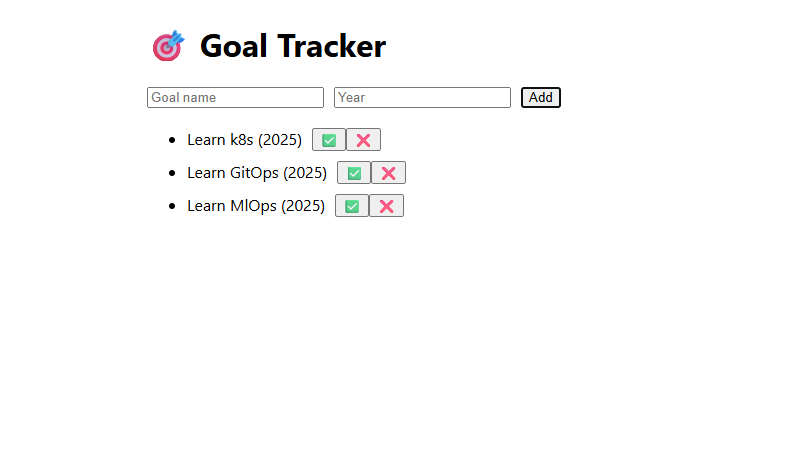

<div align="center">

# Vision Tracker

*Track your yearly goals*

</div>

<div align="center">

[](https://nextjs.org) [](https://reactjs.org) [](https://www.docker.com) [](https://www.docker.com) [](https://www.ansible.com) [](https://hub.docker.com) [](https://aws.amazon.com/ec2/)

</div>


VisionTracker is a professional web application designed to help users set, track, complete, and delete their yearly goals efficiently. Built with a React frontend and a Next.js backend, this app provides a seamless experience for managing personal or professional objectives throughout the year.  

This project automates the setup of a full-stack development and production environment using React (frontend) and Next.js (backend), managed via Docker Compose and Ansible. Key features include:

 - [x] Provisioning a VM with Docker and Docker Compose using Ansible

 - [x] Local development support with live-reloading for seamless developer experience

 - [x] Production-ready Docker Compose with restart policies and health checks

 - [x] Ansible playbooks to:

      - Build multi-architecture Docker images (x86_64, arm64)
      - Push images to a private DockerHub registry
      - Deploy the production stack to the remote VM
      <!-- - Image size analysis and strategies to reduce image sizes -->

# Application Features

## 1. Local Development Environment
- **React Frontend:** A modern React-based frontend application for building user interfaces.
- **Next.js Backend:** A powerful backend built with Next.js for server-side rendering and API routes.
- **Hot Reloading:** Developers can see code changes instantly without rebuilding Docker images, ensuring a seamless development experience.
- **Dockerized Setup:** Both frontend and backend are containerized using Docker for consistent and portable development environments.

## 2. Production-Grade Docker Compose
- **Restart Policies:** Ensures containers automatically restart in case of failures or system reboots.
- **Health Checks:** Monitors the health of containers to ensure they are running as expected.
- **Multi-Architecture Support:** Docker images are built for both x86 and arm64 architectures, ensuring compatibility across different systems.

## 3. Ansible Automation

- **Infrastructure Setup:** Ansible playbooks automate the installation of Docker and Docker Compose on the AWS EC2 instance.
- **Image Building and Pushing:**
      - build_and_push.yml playbook builds Docker images for both architectures and pushes them to a private DockerHub registry.
- **Deployment:**
      - deploy.yml playbook deploys the production-grade Docker Compose setup on the VM.

## 4. Scalable and Portable

- The setup is designed to be easily scalable and portable across different environments, making it suitable for both development and production use cases.

## Future Enhancements

- User authentication and profiles
- Persistent database integration (e.g., MongoDB, PostgreSQL)
- Notifications and reminders
- Analytics dashboard for goal progress
- Automate testing, building, and deployment with CI/CD
- Deployment to Kubernetes for scaling 

## Demo


# Local Setup

```bash
# Clone the Repository:
git clone https://github.com/iam-linckon/vision-tracker.git
cd vision-tracker

# Use the development Docker Compose file to start the environment:
docker-compose -f docker-compose.dev.yml up

#Stop the running containers:
docker-compose -f docker-compose.dev.yml down
```

# Production Deployment

To deploy the application to a production environment, follow these steps:
1. **Prepare the VM:**
   - Launch an EC2 instance or VM with a Linux distribution.
   - Use the provided Ansible playbook to install Docker and Docker Compose on the EC2 instance:
```bash
ansible-playbbok -i inventory.ini install_docker.yml
```
2. **Build and Push Docker Images:**
   - Use the `build_and_push.yml` playbook to build Docker images for both architectures and push them to your private DockerHub registry:
```bash
ansible-playbook build_and_push.yml
```
3. **Deploy the Application**
   - Use the deploy.yml playbook to deploy the production-grade Docker Compose setup on the VM:
```bash
ansible-playbook -i inventory.ini deploy.yml
```
# Environment Variables

Ensure you have the following environment variables set in your `.env` file or in your environment:
```bash
export DOCKERHUB_PASSWORD=your_dockerhub_password
source .env
```


